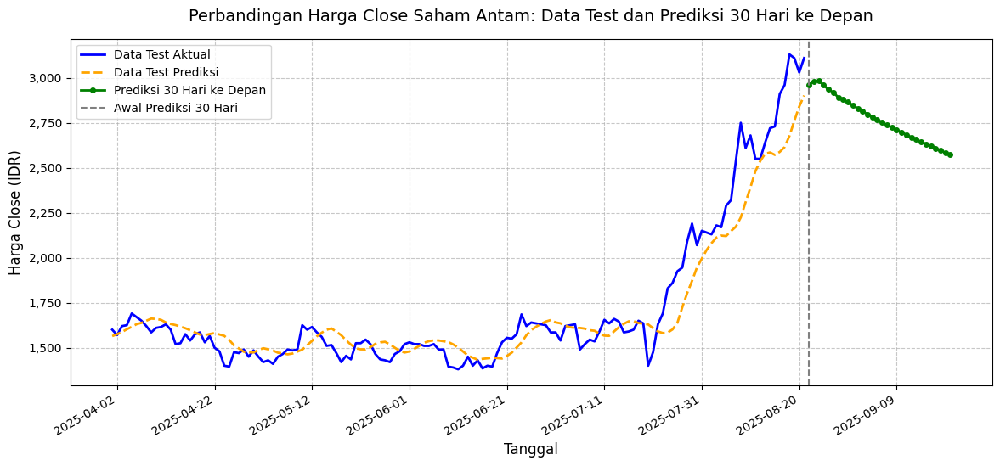

# prediksi-saham-PT-Antam
Prediksi harga saham merupakan tantangan signifikan dalam dunia keuangan karena sifatnya yang volatil dan dipengaruhi oleh berbagai faktor, seperti kondisi ekonomi, harga komoditas global, dan kebijakan perusahaan. PT Aneka Tambang Tbk (ANTM), sebagai salah satu perusahaan tambang terbesar di Indonesia yang bergerak di sektor nikel, emas, dan bauksit, memiliki pergerakan harga saham yang dipengaruhi oleh fluktuasi harga komoditas dan dinamika pasar domestik. Dengan meningkatnya jumlah investor ritel di Indonesia, yang mencatatkan pertumbuhan sebesar 28% pada tahun 2020 [1], kebutuhan akan alat prediksi harga saham yang akurat semakin penting untuk mendukung pengambilan keputusan investasi yang lebih terinformasi.

Masalah ini relevan karena prediksi harga saham yang akurat dapat membantu investor ritel meminimalkan risiko dan memaksimalkan keuntungan. Pendekatan machine learning, khususnya algoritma Long Short-Term Memory (LSTM), efektif untuk menangkap pola non-linear dan dependensi temporal dalam data harga saham, yang sulit dilakukan oleh metode konvensional. Penelitian sebelumnya menunjukkan bahwa LSTM mampu memberikan akurasi prediksi yang tinggi untuk harga saham [2]. Oleh karena itu, proyek ini bertujuan untuk mengembangkan model prediksi harga saham PT Antam menggunakan LSTM untuk membantu investor ritel membuat keputusan investasi yang lebih baik.

**Referensi**:
- A. N. Karmayuda, “Machine Learning Untuk Pemodelan Pergerakan Harga Saham PT Telkom Indonesia TBK,” Undergraduate thesis, Universitas Pembangunan Jaya, 2021.[1](https://eprints.upj.ac.id/id/eprint/2388/)
- L. Setiawan, D. Susanti, and R. Riaman, “Analisis Perbandingan Hasil Peramalan Harga Saham Menggunakan Model Autoregresive Integrated Moving Average dan Long Short Term Memory,” *Jurnal Matematika Integratif*, vol. 19, no. 2, pp. 223–234, 2023.[2](https://jurnal.unpad.ac.id/jmi/article/view/42164)

## Business Understanding

### Problem Statements
- **Pernyataan Masalah 1**: Harga saham PT Antam bersifat volatil dan dipengaruhi oleh faktor eksternal seperti harga komoditas global dan kebijakan domestik, Selain itu dengan adanya kasus yang baru viral terkait dengan korupsi di perusahaan tersebut pastinya menyebabkan fluktuasi yang signifikan sehingga sulit diprediksi dengan metode konvensional.
- **Pernyataan Masalah 2**: Investor ritel membutuhkan alat prediksi yang akurat untuk mengidentifikasi tren harga saham PT Antam guna mendukung keputusan investasi yang optimal.
- **Pernyataan Masalah 3**: Data historis harga saham PT Antam memiliki pola non-linear yang kompleks, yang memerlukan pendekatan machine learning untuk menangkap dependensi temporal.

### Goals
- **Jawaban Pernyataan Masalah 1**: Mengembangkan model machine learning berbasis LSTM yang mampu memprediksi harga saham PT Antam dengan akurasi tinggi meskipun terdapat volatilitas.
- **Jawaban Pernyataan Masalah 2**: Menyediakan alat prediksi berbasis LSTM yang dapat digunakan investor ritel untuk membuat keputusan investasi yang lebih terinformasi.
- **Jawaban Pernyataan Masalah 3**: Menggunakan algoritma LSTM untuk menangkap pola non-linear dan dependensi temporal dalam data historis harga saham PT Antam.

### Solution Statements
- **Solusi 1**: Menerapkan model LSTM untuk memprediksi harga saham PT Antam berdasarkan data historis, dengan metrik evaluasi Mean Absolute Percentage Error (MAPE) dan Root Mean Squared Error (RMSE) untuk mengukur akurasi prediksi.
- **Solusi 2**: Mengoptimalkan arsitektur model LSTM dengan konfigurasi dua layer LSTM dan layer Dense untuk menangkap pola harga saham dengan baik.
- **Solusi 3**: Menyediakan visualisasi prediksi harga saham untuk membantu investor ritel memahami tren harga dan membuat keputusan investasi.

## Data Understanding

Dataset yang digunakan adalah data historis harga saham PT Aneka Tambang Tbk (ANTM) dari Yahoo Finance ([https://finance.yahoo.com/quote/ANTM.JK/history](https://finance.yahoo.com/quote/ANTM.JK/history)). Data ini mencakup periode dari 30 Mei 2022 hingga 28 Mei 2025, dengan interval harian, dan terdiri dari 720 baris data. Dataset mencakup harga pembukaan, penutupan, tertinggi, terendah, volume perdagangan, dividen, dan stock split.

### Variabel-variabel pada dataset ANTM adalah sebagai berikut:
- **Open**: Harga pembukaan saham pada hari perdagangan tertentu (dalam Rupiah).
- **High**: Harga tertinggi saham pada hari perdagangan (dalam Rupiah).
- **Low**: Harga terendah saham pada hari perdagangan (dalam Rupiah).
- **Close**: Harga penutupan saham pada hari perdagangan (dalam Rupiah).
- **Volume**: Jumlah saham yang diperdagangkan pada hari tertentu.
- **Dividends**: Laba perusahaan yang dibagikan kepada pemegang saham.
- **Stock Splits**: Aksi korporasi di mana perusahaan memecah harga saham per lembar menjadi lebih rendah dengan rasio tertentu.


**Exploratory Data Analysis (EDA)**:
- **Korelasi Antar Variabel**: Heatmap korelasi menunjukkan bahwa harga penutupan (Close) memiliki korelasi kuat dengan harga pembukaan (Open), tertinggi (High), dan terendah (Low), dengan nilai korelasi mendekati 1, menandakan ketergantungan temporal yang kuat.
- **Pair Plot**: Pair plot fitur numerik (Open, High, Low, Close, Volume) menggambarkan hubungan linier antar harga saham, dengan Volume menunjukkan distribusi yang lebih bervariasi.
- **Pemeriksaan Data Hilang**: Tidak ditemukan data hilang dalam dataset, sehingga integritas data terjaga. ini terbukti dari setiap kolom memiliki data yang sama ketika `data.info()` yaitu 720 baris

## Data Preparation

Proses persiapan data dilakukan untuk memastikan dataset dapat digunakan secara optimal oleh model machine learning. Berikut adalah tahapan yang dilakukan:

1. **Pembersihan Data**:
   - Proses: Menghapus kolom *Dividends* dan *Stock Splits* karena tidak relevan untuk prediksi harga saham (memiliki korelasi yang rendah).
   - Alasan: Mengurangi noise dan kompleksitas model dengan hanya menggunakan fitur yang relevan (Open, High, Low, Close, Volume) dan memiliki korelasi yang rendah.

2. **Penyesuaian Indeks dan Format Tanggal**:
    - Proses: Merubah indeks dalam bentuk datatime. 
    - Alasan: Data historis dari yfinance menggunakan kolom Date sebagai indeks sehingga perlu disesuaikan agar memungkinkan operasi berbasis waktu.
    - **Contoh kode**:
    ```python
      data.reset_index(inplace=True)
      data['Date'] = pd.to_datetime(data['Date'], errors='coerce')
     ```
3. **Pemeriksaan dan Penanganan Tanggal Tidak Valid**:
    - Proses: Memeriksa jumlah tanggal yang tidak valid (`NaT`/`NaN`) dalam kolom `Date`, menghapus baris yang mengandung tanggal tidak valid (jika ada), dan menampilkan lima baris pertama DataFrame untuk memverifikasi struktur data.
    - Alasan: Untuk memeriksa valid atau tidak validnya tanggal dalam data
    - **Contoh Kode**:
     ```python
      invalid_dates = data['Date'].isnull().sum()
      print(f'Number of invalid dates: {invalid_dates}')

      if invalid_dates > 0:
          data = data.dropna(subset=['Date'])
          print('Dropped rows with invalid dates')

      display(data.head())
     ```

4. **Membentuk DataFrame untuk Pelatihan Model Deret Waktu (Time Window)**:
    - Proses: Yang dilakukan adalah Mengubah kolom `Close` dari data saham `ANTM.JK` menjadi format supervised learning untuk pelatihan model deret waktu. Fungsi `prepare_train_df` membuat DataFrame dengan fitur (6 harga penutupan sebelumnya) dan target (harga penutupan berikutnya). Kolom `Close` diubah menjadi array 2D sebagai input untuk fungsi. 
    - Alasan: Kolom Close dipilih karena harga penutupan adalah indikator utama kinerja saham dan sering digunakan untuk prediksi deret waktu.
    - **Contoh Kode**
     ```python
      def prepare_train_df(data_series, data_input=6):
          X, y = [], []

          for i in range(len(data_series) - data_input):
              X.append(data_series[i:i + data_input].flatten())  
              y.append(data_series[i + data_input][0]) 

          X_df = pd.DataFrame(X, columns=[f'x{i+1}' for i in range(data_input)])
          y_df = pd.Series(y, name='y')

          train_df = pd.concat([X_df, y_df], axis=1)
          return train_df

      data_series = data['Close'].values.reshape(-1, 1)
     ```

5. **Normalisasi Data**:
    - Proses: Menormalkan kolom `Close` dari data saham `ANTM.JK` ke rentang [0, 1] menggunakan `MinMaxScaler` dan mengubah data yang telah dinormalisasi menjadi DataFrame pelatihan menggunakan fungsi `prepare_train_df`. DataFrame pelatihan berisi 6 harga penutupan sebelumnya sebagai fitur (`x1` hingga `x6`) dan harga penutupan berikutnya sebagai target (`y`).
    - Alasan: Normalisasi dengan MinMaxScaler mengubah nilai harga penutupan ke rentang [0, 1] untuk memastikan skala seragam
    - **Contoh Kode**:
     ```python
     from sklearn.preprocessing import MinMaxScaler
      scaler = MinMaxScaler()
      data_scaled = scaler.fit_transform(data_series)
     ```

6. **Memisahkan Fitur, Mereshape, dan Membagi Data untuk Pelatihan**:
   - Proses: Memisahkan fitur (`X`) dan target (`y`) dari DataFrame pelatihan (`train_df`), mereshape `X` menjadi format `(samples, timesteps, features)` yang sesuai untuk model deret waktu, dan membagi data menjadi set pelatihan (80%) dan pengujian (20%).
   - Alasan: 
      - Kolom fitur (x1 hingga x6) diambil sebagai input model, dan kolom y sebagai target yang akan diprediksi
      - Karena setiap baris X memiliki 6 fitur (timesteps) dan hanya satu fitur per timestep, X diubah menjadi bentuk (n, 6, 1), di mana n adalah jumlah sampel.
      - Data dibagi menjadi set pelatihan (80%) dan pengujian (20%) untuk melatih model dan mengevaluasi performanya.

## Modeling
Model yang digunakan dalam proyek ini adalah Long Short-Term Memory (LSTM), dipilih karena kemampuannya menangkap pola non-linear dan dependensi jangka panjang dalam data deret waktu. LSTM mengatasi keterbatasan RNN tradisional, seperti vanishing gradient, dengan mekanisme internal yang melibatkan gates (forget gate, input gate, output gate) dan cell state. Forget gate memutuskan informasi lama yang perlu dihapus, input gate mengatur data baru yang akan disimpan, dan output gate menentukan output berdasarkan informasi yang relevan, sementara cell state bertindak sebagai memori jangka panjang untuk menyimpan dan memperbarui informasi sekuensial. Kombinasi ini memungkinkan LSTM mempelajari pola jangka panjang secara efektif.

### Model LSTM
- **Arsitektur**: Model LSTM dibangun dengan 2 layer LSTM (100 unit dan 50 unit), masing-masing diikuti oleh Dropout (0.3) untuk mencegah overfitting, dan dua layer Dense (25 unit dengan aktivasi ReLU dan 1 unit untuk output).
- **Parameter**:
  - Epoch: 100
  - Batch size: 32
  - Optimizer: Adam
  - Learning rate: 0.001
  - Callbacks: EarlyStopping (patience=15) dan ReduceLROnPlateau (factor=0.2, patience=5)
- **Kelebihan**:
  - Mampu menangkap dependensi jangka panjang dalam data deret waktu.
  - Efektif untuk data non-linear seperti harga saham.[2](https://repository.bsi.ac.id/repo/51717/PENERAPAN-DATA-MINING-DALAM-PREDIKSI-HARGA-SAHAM-DI-INDONESIA-MENGGUNAKAN-ALGORITMA-LSTM)
- **Kekurangan**:
  - Membutuhkan waktu pelatihan yang lebih lama dibandingkan model statistik.
  - Sensitif terhadap pengaturan hyperparameter.

## Evaluation

### Metrik Evaluasi
Metrik yang digunakan adalah:
- **Mean Absolute Percentage Error (MAPE)**: Mengukur persentase kesalahan rata-rata relatif terhadap nilai aktual. Formula:  
  $\text{MAPE} = \frac{1}{n} \sum_{i=1}^n \left| \frac{y_i - \hat{y}_i}{y_i} \right| \times 100$
- **Root Mean Squared Error (RMSE)**: Mengukur akar kuadrat rata-rata kesalahan kuadrat. Formula:  
  $\text{RMSE} = \sqrt{\frac{1}{n} \sum_{i=1}^n (y_i - \hat{y}_i)^2}$

- **Model LSTM**:
  - MAPE: 4.741% (akurat hingga 95.259%)
  - RMSE: 0.06730266103663025 (dalam Rupiah)

### Laporan Evaluasi Model: Prediksi Harga Saham PT Antam Menggunakan LSTM
- **Hasil & Pencapaian 1** : Model LSTM yang dikembangkan mencapai MAPE sebesar 4.741% pada data uji (akurat hingga 95.259%) dan RMSE sebesar 0.06730266103663025 dalam skala normalisasi (setelah inversi normalisasi, error dalam rupiah tetap kecil). Ini menunjukkan bahwa model mampu menangani volatilitas dengan baik, memberikan prediksi yang akurat meskipun ada fluktuasi signifikan. Visualisasi menunjukkan model dapat mengikuti tren harga aktual, bahkan pada periode volatilitas tinggi, meskipun ada sedikit penyimpangan. Goal ini tercapai karena model memberikan akurasi tinggi dan konsistensi dalam prediksi.
- **Hasil & Pencapaian 2** : Model LSTM memberikan prediksi harga saham dengan MAPE 4.741%, yang berarti error rata-rata relatif hanya 4.741% dari harga aktual, memberikan kepercayaan tinggi bagi investor ritel. Selain itu, prediksi 30 hari ke depan (29 Mei 2025 hingga 27 Juni 2025, disesuaikan dengan tanggal saat ini) menunjukkan tren stabil dengan fluktuasi ringan, memberikan wawasan berharga bagi investor untuk merencanakan strategi beli/jual. Visualisasi yang disediakan mempermudah investor memahami tren, sehingga alat ini dapat diandalkan untuk pengambilan keputusan investasi. Goal ini tercapai karena model memberikan prediksi yang akurat dan alat visual yang mendukung investor ritel. 
- **Hasil & Pencapaian 2**: Model LSTM dengan dua lapisan (100 dan 50 unit) dan lapisan Dense berhasil menangkap pola non-linear dan dependensi temporal, seperti terlihat dari visualisasi yang menunjukkan keselarasan antara prediksi dan data aktual. MAPE yang rendah (4.741%) dan RMSE yang kecil (0.06730266103663025 dalam skala normalisasi) mengindikasikan bahwa model efektif dalam memodelkan hubungan temporal yang kompleks. Goal ini tercapai karena LSTM terbukti mampu menangani pola non-linear dalam data historis.

**Visualisasi Hasil**:


### Dampak dari Solution Statements
- **Solusi 1**: Menerapkan model LSTM untuk memprediksi harga saham PT Antam berdasarkan data historis, dengan metrik evaluasi MAPE dan RMSE untuk mengukur akurasi prediksi.
  - **Dampak**: Solusi ini berdampak positif karena model LSTM memberikan akurasi tinggi dengan MAPE 4.550% dan RMSE 0.061962692809850506 (dalam skala normalisasi, error kecil dalam rupiah setelah inversi). Akurasi ini memungkinkan investor ritel mempercayai prediksi model untuk keputusan investasi, mengatasi tantangan volatilitas yang disebutkan dalam Pernyataan Masalah 1. Metrik MAPE dan RMSE memberikan ukuran yang jelas tentang performa model, memenuhi kebutuhan untuk alat prediksi yang akurat (Pernyataan Masalah 2).
- **Solusi 2**: Mengoptimalkan arsitektur model LSTM dengan konfigurasi dua layer LSTM dan layer Dense untuk menangkap pola harga saham dengan baik.
  - **Dampak**: Arsitektur ini berdampak signifikan dalam menangkap pola non-linear dan dependensi temporal (Pernyataan Masalah 3), seperti terlihat dari visualisasi yang menunjukkan keselarasan prediksi dengan data aktual. Penggunaan dua lapisan LSTM (100 dan 50 unit) memungkinkan model mempelajari pola yang lebih kompleks, sementara lapisan Dense dan Dropout (0.3) mencegah overfitting, menghasilkan generalisasi yang baik (MAPE 4.550% pada data uji). Ini mendukung pencapaian Goal 1 dan 3 dengan memberikan model yang robust dan akurat.
- **Solusi 3**: Menyediakan visualisasi prediksi harga saham untuk membantu investor ritel memahami tren harga dan membuat keputusan investasi.
  - **Dampak**: Visualisasi memiliki dampak besar bagi investor ritel (Pernyataan Masalah 2) dengan memberikan gambaran jelas tentang tren harga, baik pada data test maupun prediksi 30 hari ke depan (29 Mei 2025 hingga 27 Juni 2025). Plot garis yang membandingkan data aktual, prediksi, dan forecasting memungkinkan investor melihat akurasi model dan tren masa depan, mendukung pengambilan keputusan yang lebih terinformasi (Goal 2). Visualisasi juga membantu mengidentifikasi potensi penyimpangan pada periode volatilitas tinggi, memberikan wawasan tambahan untuk strategi investasi.

### Kesimpulan:
**Pencapaian Problem Statements**:
- Model LSTM berhasil mengatasi volatilitas harga saham PT Antam (Pernyataan Masalah 1) dengan MAPE 4.550% dan RMSE kecil, menunjukkan akurasi tinggi meskipun ada faktor eksternal seperti kasus korupsi.
- Alat prediksi ini memenuhi kebutuhan investor ritel (Pernyataan Masalah 2) dengan memberikan prediksi akurat dan visualisasi yang informatif, mendukung keputusan investasi yang lebih baik.
- Pendekatan LSTM efektif menangkap pola non-linear dan dependensi temporal (Pernyataan Masalah 3), seperti terlihat dari keselarasan prediksi dengan data aktual.
**Pencapaian Goals**: Semua goal tercapai dengan baik, dengan model LSTM memberikan akurasi tinggi (Goal 1), alat prediksi yang bermanfaat bagi investor ritel (Goal 2), dan kemampuan menangkap pola kompleks (Goal 3).
**Dampak Solusi Statements**:
Solusi 1 (model LSTM dengan MAPE dan RMSE) memberikan alat prediksi yang akurat, mengurangi risiko keputusan investasi yang salah.
Solusi 2 (arsitektur LSTM) memastikan model robust dalam menangani pola kompleks, mendukung akurasi tinggi.
Solusi 3 (visualisasi) memberikan dampak langsung bagi investor ritel dengan menyajikan informasi yang mudah dipahami untuk strategi investasi.
